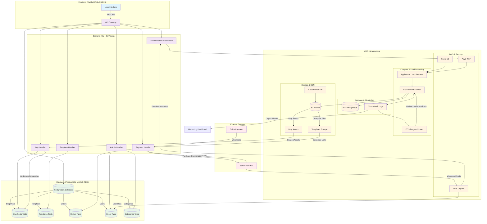

# Company Blog & Template Store Architecture

## Component Details

### Frontend Components
- **User Interface**: Vanilla HTML/CSS/JS with Tailwind CSS
- **Pages**: Home, Blog, Template Catalog, Template Details, About, Contact
- **Features**: Responsive design, search, social sharing, breadcrumbs

### Backend Components (Go)
- **API Gateway**: Main entry point for all requests
- **Authentication Middleware**: AWS Cognito integration and JWT validation
- **Blog Handler**: Markdown processing and blog post management
- **Template Handler**: Template CRUD operations and preview generation
- **Payment Handler**: Stripe integration and order processing
- **Admin Handler**: Admin interface for content management

### Database Schema (PostgreSQL)
- **Blog Posts**: Content, metadata, SEO fields
- **Templates**: File info, categories, pricing, preview data
- **Orders**: Purchase history, delivery status, user info
- **Users**: Customer accounts and preferences (linked to Cognito)
- **Categories**: Template and blog categorization

### AWS Infrastructure
- **ECS/Fargate**: Containerized Go backend
- **RDS**: Managed PostgreSQL database
- **S3**: Template file storage with CloudFront CDN
- **ALB**: Load balancing and SSL termination
- **Route 53**: DNS management
- **CloudWatch**: Monitoring and logging
- **WAF**: Web application firewall
- **Cognito**: User authentication and management

### External Integrations
- **Stripe**: Payment processing and webhooks
- **SendGrid**: Reliable email delivery for templates and notifications

## Data Flow
1. **User Request** → ALB → ECS → Go Backend
2. **Authentication** → Cognito → JWT validation → API access
3. **API Calls** → Database queries → PostgreSQL
4. **Template Access** → S3 → CloudFront → User
5. **Payment Flow** → Stripe → Webhook → SendGrid → Email Delivery
6. **Blog Content** → Markdown processing → Database → Frontend 